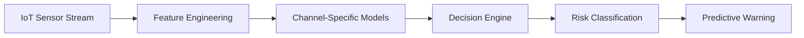

<div align="center">


<br/>

<a href="mailto:guner.kaan@outlook.com">
  
</a>
<a href="https://github.com/kaanguner4">
  
</a>

</div>

<br/>

## `01 / PROFILE`

I am a **Computer Engineering student** building production-oriented systems across **Artificial Intelligence, Machine Learning, Data Engineering, and backend development**.

My work focuses on turning raw data into reliable decisions through predictive models, APIs, databases, and deployable infrastructure.

```yaml
name: Kaan Güner
location: Türkiye
focus:
  - AI Engineering
  - Data Engineering
  - Industrial IoT
  - Time-Series Forecasting
currently_building:
  - Water Anomaly Detection Platform
  - Predictive Alert Systems
```

---

## `02 / CORE CAPABILITIES`

<table>
<tr>
<td width="50%" valign="top">

### Artificial Intelligence

- Supervised machine learning
- Time-series feature engineering
- Anomaly detection
- Predictive alert systems
- Model evaluation and optimization
- Computer vision fundamentals

</td>
<td width="50%" valign="top">

### Data & Backend Engineering

- REST API development
- PostgreSQL and MySQL
- Redis-based pipelines
- Data processing with Pandas
- Dockerized services
- Authentication and role-based systems

</td>
</tr>
</table>

---

## `03 / TECHNOLOGY STACK`

<div align="center">

### Languages


### AI, Data & Infrastructure


</div>

---

## `04 / FLAGSHIP SYSTEM`

### Industrial Water Anomaly Detection

A production-oriented AI system that analyzes industrial water-quality sensor streams and generates early warnings before measurements reach critical alarm limits.



**System scope**

`Multi-channel ML` · `Time-series forecasting` · `Dynamic channel mapping` · `Redis history` · `FastAPI services` · `Docker deployment`

> Active private R&D project developed using real on-site IoT sensor data.

---

## `05 / SELECTED PROJECTS`

<table>
<tr>
<td width="50%" valign="top">

### Car Price Predictor

Machine-learning regression application comparing ensemble models for used-car price estimation.

`Python` `Scikit-Learn` `CatBoost` `LightGBM` `Streamlit`

[Explore repository →](https://github.com/kaanguner4/CarPricePredictor-ML-Model)

</td>
<td width="50%" valign="top">

### Track Learner AI

An experimental reinforcement-learning project in which an autonomous agent learns to navigate a track.

`Python` `NEAT` `Simulation` `AI`

[Explore repository →](https://github.com/kaanguner4/TrackLearnerAI)

</td>
</tr>
<tr>
<td width="50%" valign="top">

### NAC System

A backend-oriented Network Access Control system covering authentication, authorization, and accounting concepts.

`FastAPI` `PostgreSQL` `Redis` `Python`

[Explore repository →](https://github.com/kaanguner4/NAC-System)

</td>
<td width="50%" valign="top">

### Auto Care Hub

A full-stack vehicle service management platform with users, vehicles, appointments, and administrative workflows.

`Node.js` `Express.js` `MySQL` `Bootstrap`

[Explore repository →](https://github.com/kaanguner4/AutoCareHub)

</td>
</tr>
</table>

---

## `06 / CURRENT DIRECTION`

```text
AI Engineering      Predictive systems • anomaly detection • model evaluation
Data Engineering    Time-series pipelines • SQL • Redis • structured data
Backend Systems     FastAPI • Node.js • REST APIs • PostgreSQL
Infrastructure      Docker • GitHub • Linux • Supabase
Next                MLOps • PyTorch • Airflow • Kafka • Kubernetes
```

---

<div align="center">

### `TURNING DATA INTO INTELLIGENT DECISIONS`

</div>
