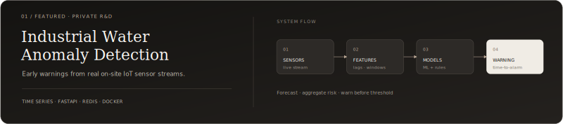

 

<a href="mailto:guner.kaan@outlook.com">Email</a>
&nbsp;&nbsp;·&nbsp;&nbsp;
<a href="#selected-work">Selected work</a>

 

## Profile

Computer Engineering student working across **AI, data, and backend engineering**. I am interested in predictive systems built around real-world data: from sensing and pipelines to models, APIs, and operational decisions.

## Current work

### Industrial Water Anomaly Detection

A production-oriented system that analyses industrial water-quality sensor streams and generates early warnings before measurements reach critical alarm limits.

`Time-series forecasting` · `Anomaly detection` · `Feature engineering` · `FastAPI` · `Redis` · `Docker`

Private R&D project developed with real on-site IoT sensor data.

## Selected work

<table>
<tr>
<td width="50%" valign="top">

</td>
<td width="50%" valign="top">

</td>
</tr>
<tr>
<td width="50%" valign="top">

</td>
<td width="50%" valign="top">

</td>
</tr>
</table>

## Engineering practice

BTK Akademi — Introduction to Deep Learning

  

