

<picture>
  <source media="(prefers-color-scheme: dark)" srcset="./assets/hero.svg" />
  <source media="(prefers-color-scheme: light)" srcset="./assets/light/hero.svg" />
  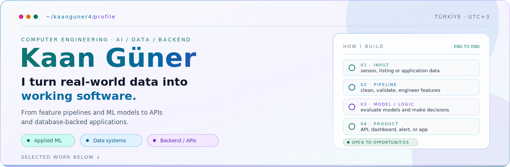
</picture>

 

<a href="#profile"><b>profile &amp; contribution</b></a>
&nbsp;&nbsp;·&nbsp;&nbsp;
<a href="#selected-work"><b>selected work</b></a>
&nbsp;&nbsp;·&nbsp;&nbsp;
<a href="#contact"><b>contact</b></a>

 

<picture>
  <source media="(prefers-color-scheme: dark)" srcset="./assets/section-about.svg" />
  <source media="(prefers-color-scheme: light)" srcset="./assets/light/section-about.svg" />
  
</picture>

<h3>Computer Engineering Student · Applied AI, Data Systems &amp; Backend</h3>

<strong>I turn real-world data into working software.</strong> 
From feature pipelines and machine-learning models to APIs and database-backed applications.

<a href="#selected-work"><b>Explore the proof ↓</b></a>

 

<picture>
  <source media="(prefers-color-scheme: dark)" srcset="./assets/about.svg" />
  <source media="(prefers-color-scheme: light)" srcset="./assets/light/about.svg" />
  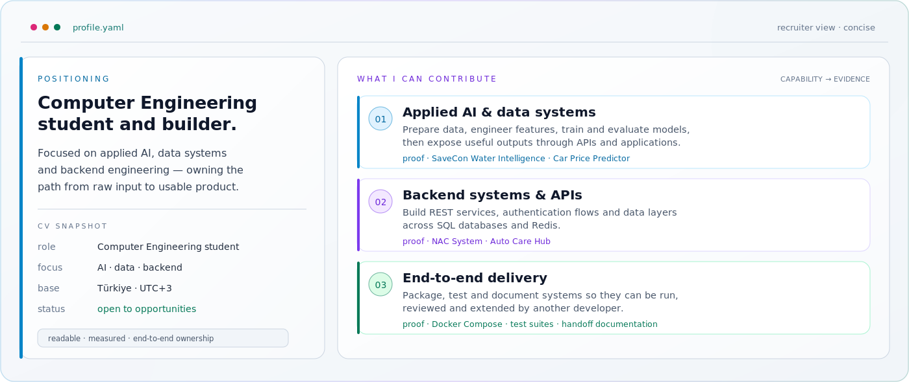
</picture>

<picture>
  <source media="(prefers-color-scheme: dark)" srcset="./assets/divider.svg" />
  <source media="(prefers-color-scheme: light)" srcset="./assets/light/divider.svg" />
  
</picture>

<picture>
  <source media="(prefers-color-scheme: dark)" srcset="./assets/section-projects.svg" />
  <source media="(prefers-color-scheme: light)" srcset="./assets/light/section-projects.svg" />
  
</picture>

<h3>Selected projects</h3>

Each card opens the repository, where you can inspect the architecture, code and documentation.

 

<a href="https://github.com/kaanguner4/SaveCon-Water-Anomaly-Detection">
<picture>
  <source media="(prefers-color-scheme: dark)" srcset="./assets/project-water.svg" />
  <source media="(prefers-color-scheme: light)" srcset="./assets/light/project-water.svg" />
  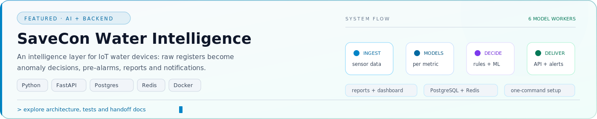
</picture>
</a>

<table>
<tr>
<td width="50%" valign="top">
<a href="https://github.com/kaanguner4/CarPricePredictor-ML-Model">
<picture>
  <source media="(prefers-color-scheme: dark)" srcset="./assets/project-car-price.svg" />
  <source media="(prefers-color-scheme: light)" srcset="./assets/light/project-car-price.svg" />
  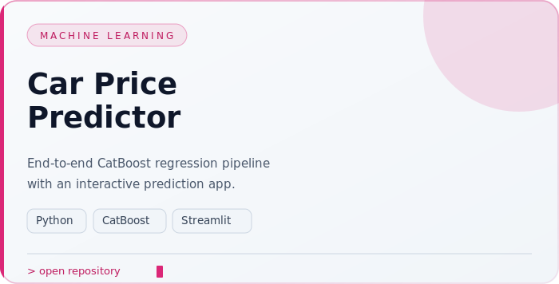
</picture>
</a>
</td>
<td width="50%" valign="top">
<a href="https://github.com/kaanguner4/NAC-System">
<picture>
  <source media="(prefers-color-scheme: dark)" srcset="./assets/project-nac.svg" />
  <source media="(prefers-color-scheme: light)" srcset="./assets/light/project-nac.svg" />
  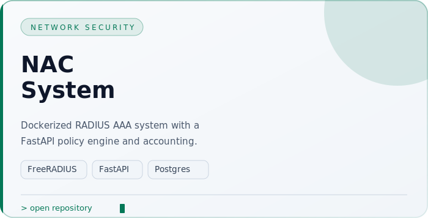
</picture>
</a>
</td>
</tr>
<tr>
<td width="50%" valign="top">
<a href="https://github.com/kaanguner4/TrackLearnerAI">
<picture>
  <source media="(prefers-color-scheme: dark)" srcset="./assets/project-track-learner.svg" />
  <source media="(prefers-color-scheme: light)" srcset="./assets/light/project-track-learner.svg" />
  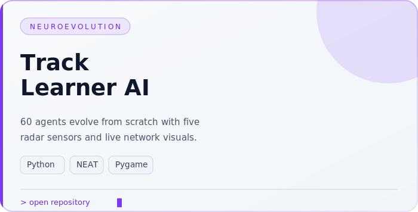
</picture>
</a>
</td>
<td width="50%" valign="top">
<a href="https://github.com/kaanguner4/AutoCareHub">
<picture>
  <source media="(prefers-color-scheme: dark)" srcset="./assets/project-auto-care.svg" />
  <source media="(prefers-color-scheme: light)" srcset="./assets/light/project-auto-care.svg" />
  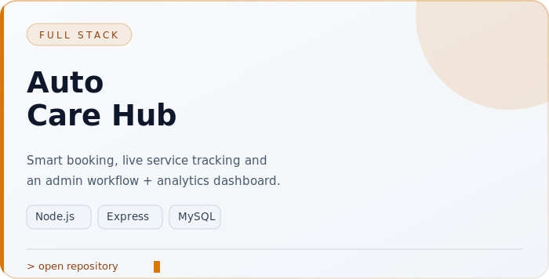
</picture>
</a>
</td>
</tr>
</table>

 

<picture>
  <source media="(prefers-color-scheme: dark)" srcset="./assets/section-activity.svg" />
  <source media="(prefers-color-scheme: light)" srcset="./assets/light/section-activity.svg" />
  
</picture>

<picture>
  <source media="(prefers-color-scheme: dark)" srcset="./assets/activity-board.svg" />
  <source media="(prefers-color-scheme: light)" srcset="./assets/light/activity-board.svg" />
  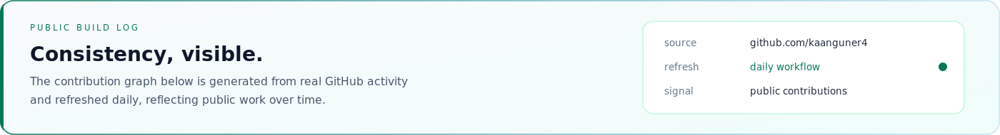
</picture>

<picture>
  <source media="(prefers-color-scheme: dark)" srcset="https://raw.githubusercontent.com/kaanguner4/kaanguner4/output/github-contribution-grid-snake-dark.svg" />
  <source media="(prefers-color-scheme: light)" srcset="https://raw.githubusercontent.com/kaanguner4/kaanguner4/output/github-contribution-grid-snake.svg" />
  
</picture>

 

<picture>
  <source media="(prefers-color-scheme: dark)" srcset="./assets/section-stack.svg" />
  <source media="(prefers-color-scheme: light)" srcset="./assets/light/section-stack.svg" />
  
</picture>

<picture>
  <source media="(prefers-color-scheme: dark)" srcset="./assets/tech-stack.svg" />
  <source media="(prefers-color-scheme: light)" srcset="./assets/light/tech-stack.svg" />
  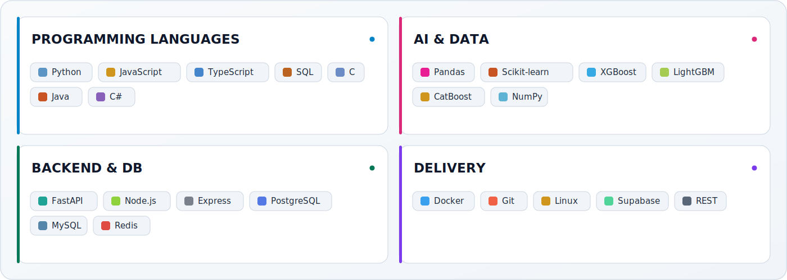
</picture>

 

<picture>
  <source media="(prefers-color-scheme: dark)" srcset="./assets/principles.svg" />
  <source media="(prefers-color-scheme: light)" srcset="./assets/light/principles.svg" />
  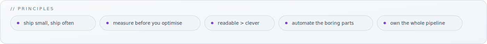
</picture>

<picture>
  <source media="(prefers-color-scheme: dark)" srcset="./assets/divider.svg" />
  <source media="(prefers-color-scheme: light)" srcset="./assets/light/divider.svg" />
  
</picture>

<picture>
  <source media="(prefers-color-scheme: dark)" srcset="./assets/section-contact.svg" />
  <source media="(prefers-color-scheme: light)" srcset="./assets/light/section-contact.svg" />
  
</picture>

<h3>Let's build something useful.</h3>

For opportunities, projects, or a good engineering conversation:

<a href="mailto:guner.kaan@outlook.com"><b>Email</b></a>
&nbsp;&nbsp;·&nbsp;&nbsp;
<a href="https://www.linkedin.com/in/kaang%C3%BCner"><b>LinkedIn</b></a>
&nbsp;&nbsp;·&nbsp;&nbsp;
<a href="https://github.com/kaanguner4"><b>GitHub</b></a>

 

<picture>
  <source media="(prefers-color-scheme: dark)" srcset="./assets/footer.svg" />
  <source media="(prefers-color-scheme: light)" srcset="./assets/light/footer.svg" />
  
</picture>
