


 

<a href="#-whoami"><b>whoami</b></a>
&nbsp;&nbsp;·&nbsp;&nbsp;
<a href="#-activity"><b>activity</b></a>
&nbsp;&nbsp;·&nbsp;&nbsp;
<a href="#-projects"><b>projects</b></a>
&nbsp;&nbsp;·&nbsp;&nbsp;
<a href="#-stack"><b>stack</b></a>
&nbsp;&nbsp;·&nbsp;&nbsp;
<a href="#-contact"><b>contact</b></a>

 


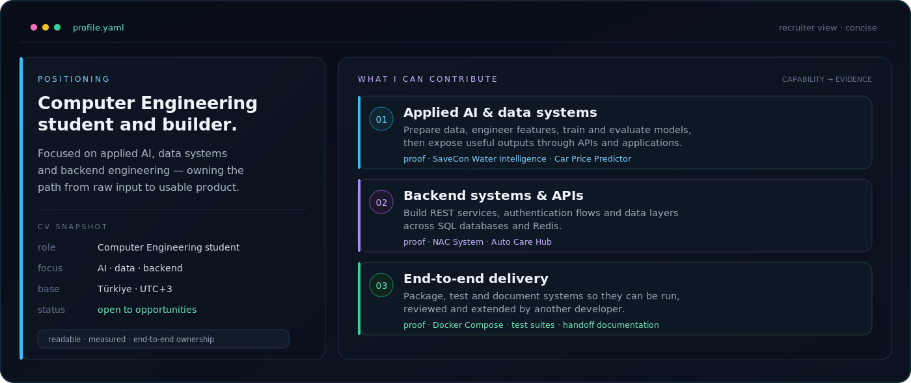

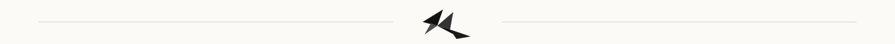



 

<b>Real contribution snake — regenerated daily from my GitHub activity</b>

<picture>
  <source media="(prefers-color-scheme: dark)" srcset="https://raw.githubusercontent.com/kaanguner4/kaanguner4/output/github-contribution-grid-snake-dark.svg" />
  <source media="(prefers-color-scheme: light)" srcset="https://raw.githubusercontent.com/kaanguner4/kaanguner4/output/github-contribution-grid-snake.svg" />
  
</picture>


<a href="https://github.com/kaanguner4">
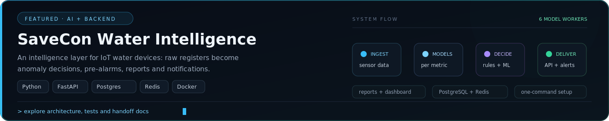
</a>

<table>
<tr>
<td width="50%" valign="top">
<a href="https://github.com/kaanguner4/CarPricePredictor-ML-Model">
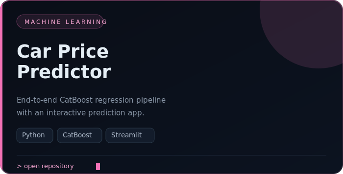
</a>
</td>
<td width="50%" valign="top">

</td>
</tr>
<tr>
<td width="50%" valign="top">
<a href="https://github.com/kaanguner4/NAC-System">
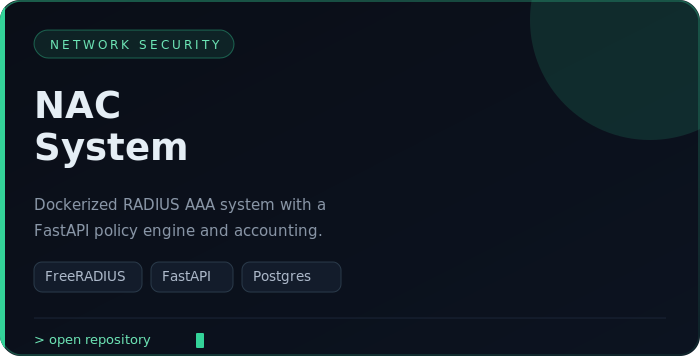
</a>
</td>
<td width="50%" valign="top">
<a href="https://github.com/kaanguner4/AutoCareHub">
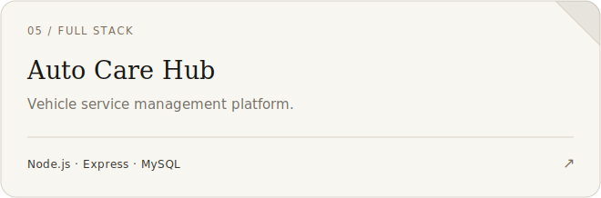
</a>
</td>
</tr>
</table>

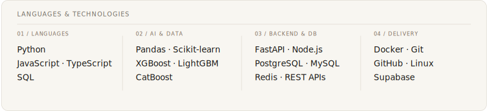

 

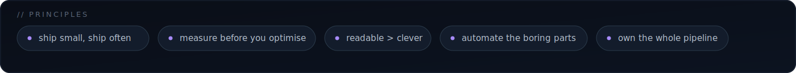

<a href="mailto:guner.kaan@outlook.com"><b>✉️ Email</b></a>
&nbsp;&nbsp;·&nbsp;&nbsp;
<a href="https://github.com/kaanguner4"><b>🐙 GitHub</b></a>

 

